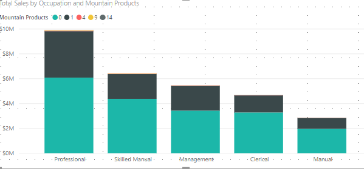

# Loading Data

## Download the sample Database



You will have 5 tables after you unzip it. 

* Sales
* Products
* Territory
* Calendar
* Customers

You can import it in Power BI Desktop.


It is possible for things to go wrong, especially the first time you load data from access. The most common cause of problems is that you have 32-bit Microsoft office installed on your PC and 64-bit Power BI ,In that case you need to download the 64-bit version of the access database.

[https://www.microsoft.com/en-nz/p/access/cfq7ttc0k7q8?activetab=pivot%3aoverviewtab](https://www.microsoft.com/en-nz/p/access/cfq7ttc0k7q8?activetab=pivot%3aoverviewtab)


You will see the tables as below:

### Relationships

Click the left side , you can see the relationships between the tables.

Power BI guessing which relationships should be used, these automatically created relationships may or may not be correct.In this case, it is correct.

### Joining tables

### Editing Query

### Remove the three fiscal solumns

### Click Close & Apply and save the pbix workbook.

### Remove the steps in a Query

### Importing new tables 

### Changing the name to SubCategory

### It has been connected automatically , you can see the relationships as below, but we don't need SubCategory table any more, just DELETED it.

